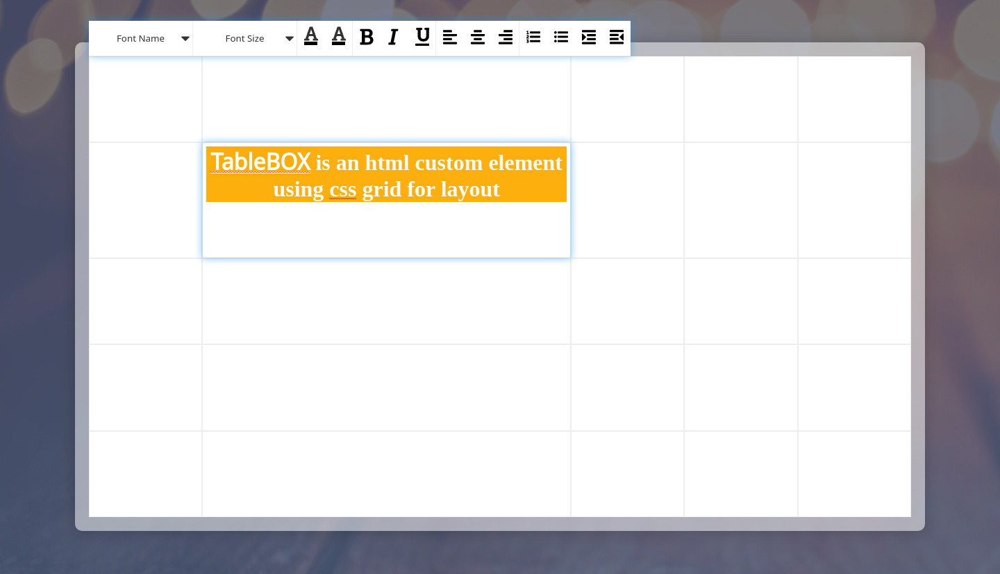

# TableBOX

TableBOX is an html custom element using css grid for layout [demo](https://mshaaban-tech.github.io/table-box/).



## Features

-   Html custom element
-   Add property to element
-   Add host listener to element
-   Format text
-   Add column & row
-   Select cells
-   Merge cells
-   Navigate between cells using arrow keys
-   Auto text direction

## TODO

-   Remove column/row
-   Format table
-   Format cell
-   Add state management

### Prerequisites

```
npm install
```

### Start

-   Start develop

    ```
    npm start
    ```

-   if using vscode, press f5 to start develop with chrome Debugger

### Build

```
npm run build
```

## Test build

```
npm run serve
```

### Formating code

```
npm run prettier
```

## Create new element

```
@CustomElement({
    selector: 'table-cell', // <table-cell></table-cell>
    template: `<div>Some Text</div>`, // Element content
    style: `color: #fff`, // Element css style
    useShadow: false // Create shadow dom element
})
export class HTMLTableBoxCellElement extends CustomElementClass {}
```

### Add property to element

```
    @Prop('number') // Property type
    public rowStart!: number; // Property name

    @Prop('array:number') // Property type array of number
    public rowsStyle: number[] = []; // Property name
```

### Add event listener

```
    @HostListener('click') // Listen for element event
    public onClick($event: Event | null = null) {
        // Add your logic here
    }

    @HostListener('click', document) // Listen for document event
    public onClick($event: Event | null = null) {
        // Add your logic here
    }
```

### Lifecycle Hooks

-   **componentWillMount** - Called before append element to dom
-   **connectedCallback** - Called while append element to dom
-   **componentDidMount** - Called after append element to dom
-   **componentWillUnmount** - Called before remove element from dom
-   **disconnectedCallback** - Called while remove element from dom
-   **componentDidUnmount** - Called after remove element from dom

## Built With

-   [parceljs](https://parceljs.org/) - Blazing fast, zero configuration web application bundler.
-   [babeljs](https://babeljs.io/) - Babel is a JavaScript compiler.
-   [autoprefixer](https://autoprefixer.github.io/) - Autoprefixer is a PostCSS plugin which parse your CSS and add vendor prefixes.

## Authors

-   **Muhammad Shaban** - _Initial work_ - [Muhammad Shaban](https://github.com/MuhammadShaban)

## License

This project is licensed under the MIT License - see the [LICENSE.md](LICENSE.md) file for details

## Acknowledgments

-   [Creating a Custom Element Decorator Using Typescript](https://medium.com/@gilfink/creating-a-custom-element-decorator-using-typescript-302e7ed3a3d1)
-   [Helpful Decorators](https://github.com/NetanelBasal/helpful-decorators) - Helpful decorators for typescript projects.
-   [Lit Element](https://github.com/Polymer/lit-element) - A simple base class for creating fast, lightweight web components.
-   [Alit Element](https://github.com/pshihn/alit-element) - A simple base class that extends lit-element with some utility functions and adds decorators.
-   [Stencil Color Picker Web Component](https://github.com/jepiqueau/stencil-color-picker) - Stencil Color Picker Web Component.
-   [Making content editable](https://developer.mozilla.org/en-US/docs/Web/Guide/HTML/Editable_content) - How to transform web page into a full and fast rich text editor.
    -   [HTML DOM execCommand](https://www.w3schools.com/jsref/met_document_execcommand.asp) - List of available commands used in formating text.
